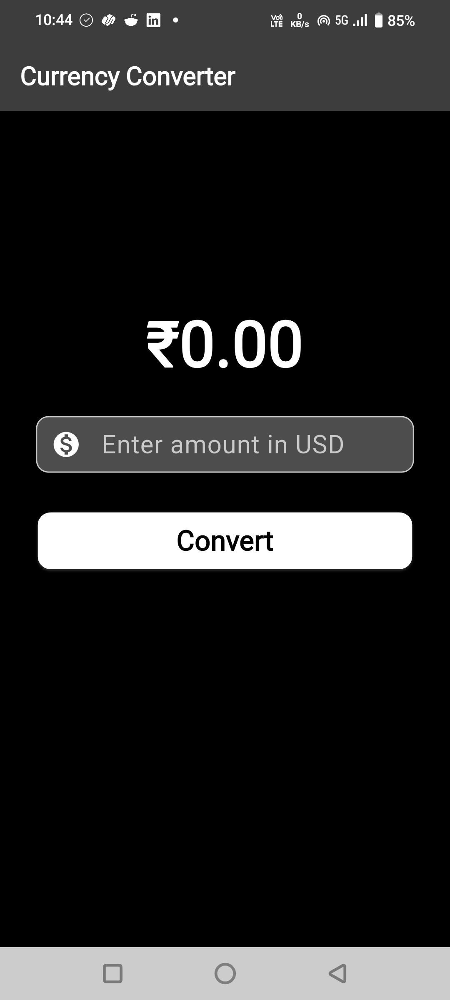
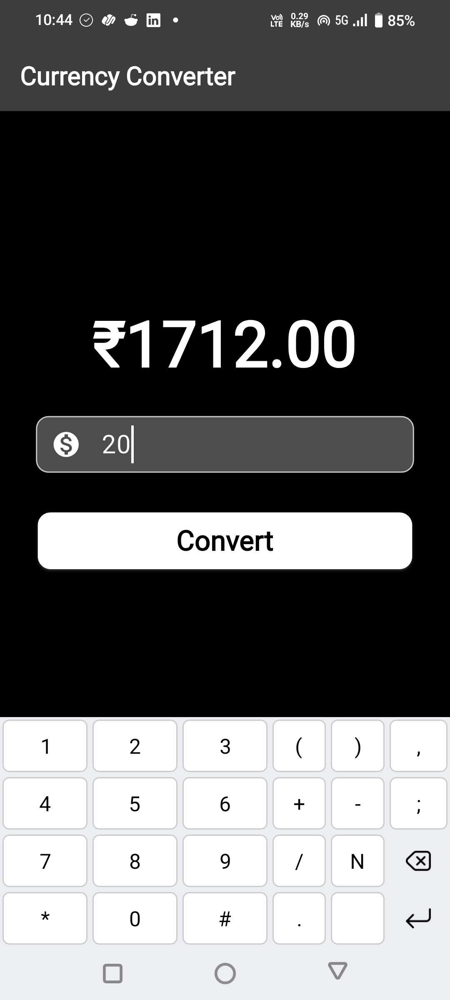

# Currency Converter

A simple Flutter app that converts currency amounts (currently supports USD input) with a clean, dark-themed UI.

## Screenshots
<table border=0px>
  <tr>
    <td></td>
    <td width="50">&nbsp;</td>
    <td></td>
  </tr>
</table>


## Features

* Input amount in USD
* Simple and intuitive user interface
* Responsive design using Flutter widgets
* Ready for expansion to support multiple currencies


## Getting Started

### Prerequisites

Ensure you have the following installed:

* [Flutter SDK](https://flutter.dev/docs/get-started/install)
* [Android Studio](https://developer.android.com/studio) with Flutter and Dart plugins
* An Android device or emulator for testing


### How to Run the App

1. **Clone or download this repository** to your local machine:

   ```bash
   git clone https://github.com/yourusername/currency_converter.git
   cd currency_converter
   ```

2. Open **Android Studio** and select **Open an existing project**, then navigate to the `currency_converter` folder.

3. Wait for Android Studio to download dependencies and configure the project.

4. Connect an Android device or start an emulator.

5. Run the app using:

   ```bash
   flutter run
   ```


## How to Use the App

1. Enter an amount in USD in the text field.
2. Tap the **Convert** button.


## Future Improvements

* Implement real-time currency conversion using APIs.
* Add support for multiple currencies with dropdown selectors.
* Improve UI/UX with animations and error handling.
* Include data persistence for user preferences.
* Add unit and widget tests to ensure app stability.
